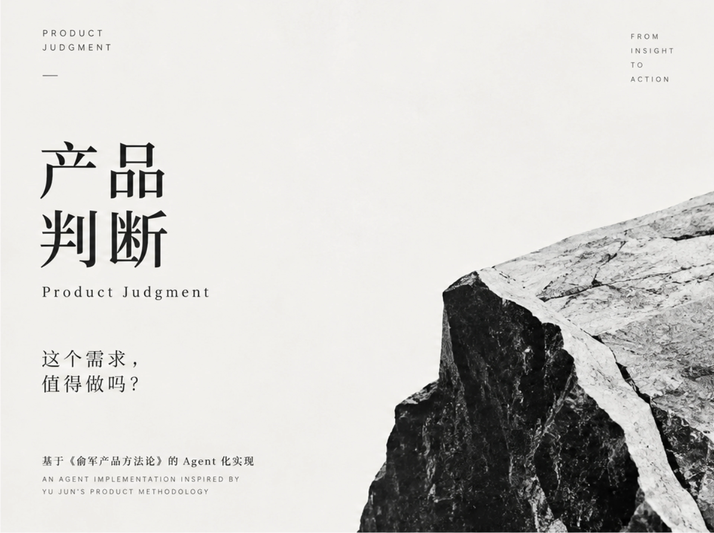

# 产品判断 · Product Judgment

<p align="center">
  
</p>

**先判断需求，再写 PRD。**

我把《俞军产品方法论》中的核心产品判断方法，转化成了 Agent 可以直接执行的需求评审流程。

核心是回答一个问题：**这个需求到底值不值得做？**

[English](README.en.md) · [SKILL.md](SKILL.md) · [Examples](examples/) · [Methodology](references/yu-jun-methodology.md)

---

## 为什么需要它

AI 让 PRD、原型和代码都变得更便宜，但**伪需求也因此更容易被快速实现**。

很多项目不是做不出来，而是从一开始就没有回答清楚：

- 真实用户是谁？
- 用户在什么具体时刻遇到问题？
- 没有这个功能时，他们现在怎么解决？
- 新体验是否真的大于旧体验与替换成本？
- 当前证据是否配得上要投入的资源？

Product Judgment 把这些问题前置，在需求进入 Roadmap、PRD 和工程开发之前做一次结构化判断。

---

## 一个典型例子

### 输入

> 竞品上线了 AI 搜索，我们也要跟进，不然用户会流失。

### 它不会直接讨论

- 用什么模型
- 搜索入口放哪里
- 多久上线
- PRD 咋写

### 它会先判断

```text
Verdict: VALIDATE FIRST / 先验证
Evidence: L0
Pattern: 竞品焦虑症

当前触发器是“竞品上线了”，不是“用户在搜索任务中遇到了已验证的问题”。
“用户会流失”仍然是假设，不是证据。
```

然后继续追问：现有搜索到底哪里失败、用户是否因此中断任务、问题是否集中在高价值场景，以及有没有更低成本的解决方式。

→ [完整示例：跟进竞品功能](examples/competitor-feature.md)

---

## 核心判断框架

### 1. 先锚定用户与场景

任何需求判断之前，先回答三件事：

```text
谁在用？
卡在哪个具体时刻？
今天怎么解决？
```

### 2. 判断用户价值

```text
用户价值 = 新体验 - 旧体验 - 替换成本
```

“新功能更强”不等于“用户价值更高”。迁移、学习、信任、流程变化，都是真实成本。

### 3. 审讯关键假设

Skill 会把需求成立所依赖的关键假设显式化，并按证据等级判断：

| Level | 证据 |
|---|---|
| L0 | 内部判断、领导意见、竞品动作 |
| L1 | 用户口头反馈、访谈、投诉 |
| L2 | 小样本行为观察、可用性测试 |
| L3 | 真实使用数据、转化、A/B |
| L4 | 付费、续费、真实商业验证 |

### 4. 失败预演

不写一句泛泛的“存在风险”，而是从用户和产品视角推演：**如果这个需求按当前逻辑继续做，几个月后具体会怎么失败。**

### 5. 给出明确判决

```text
BUILD            立项
VALIDATE FIRST   先验证
DE-SCOPE         降级做
REFRAME          重新定义
KILL             终止
```

不是“看情况”。判决只有在出现新的有效证据后才应该改变。

---

## 三种使用方式

### Quick Judgment · 快审

适合日常产品讨论、Idea、需求 sanity check。

> “我们想做一个 AI 周报功能，值不值得做？”

直接把上下文交给装载了本 Skill 的 Agent，它会先锚定用户场景，再运行判断流程。

### Formal Review · 正式评审

适合立项前、团队评审或需要留下判断记录的场景。

```bash
python scripts/demand-check.py
python scripts/demand-check.py --scan
python scripts/demand-check.py --from docs/prd.md
python scripts/demand-check.py --feature "AI会议纪要助手"
```

输出 `JUDGMENT.md`，把“为什么做 / 为什么不做”留下来，而不是只留下最终 PRD。

### Direction Setting · 方向校准

适合：方向有阻力、范围失控、知道当前方案不对但不知道应该往哪里收敛。

Skill 会先判断阻力来自证据、表达、资源还是方向本身，再给出下一步。

---

## 适合什么时候用

**推荐使用：**

- 新功能 / 新产品立项前
- PRD 开始写之前
- Roadmap 取舍
- “竞品做了，我们是不是也要做”
- “老板想做，但用户价值说不清”
- 需求范围不断膨胀，需要重新聚焦
- AI / Agent 产品快速试错时的需求 Gate

**不负责：**

- 代写完整 PRD
- 技术架构评审
- 单纯 UI / 文案优化
- 已经确认需求成立后的工程实现

---

## 安装与使用

```bash
git clone https://github.com/Longfellow1/Product-Judgment-skill.git
cd Product-Judgment-skill
```

核心 Skill 文件是 [`SKILL.md`](SKILL.md)。可用于 Claude Code、Codex 或其他支持 Skill / 系统指令注入的 Agent 工作流。

仓库同时提供：

```text
Product-Judgment-skill/
├── SKILL.md                 # 核心 Agent Skill
├── README.md
├── README.en.md
├── assets/
│   └── hero.webp            # README 头图
├── references/              # 俞军方法论、需求病型、用户价值公式
├── examples/                # 完整评审案例
├── scripts/
│   └── demand-check.py      # 交互式正式评审
└── templates/
    ├── JUDGMENT.md          # 评审记录模板
    └── CLAUDE.md            # Claude Code gate 模板
```

---

## 方法来源与致谢

本 Skill **基于《俞军产品方法论》及相关公开产品思想中的核心方法**，重点包括用户模型、用户价值、交易模型与产品决策，并由本项目重新整理为适用于 AI Agent 的可执行流程。

感谢俞军老师及其同事分享了这么精彩、好用的产品方法论，让我们在做产品设计以及取舍时有良好的依据。

这不是对书本的摘要，也不是原文复刻；它是一套面向实际需求评审的 Agent 化实现。

**本项目为非官方作品，与俞军本人无隶属、授权或背书关系。**

详细整理见 [`references/yu-jun-methodology.md`](references/yu-jun-methodology.md)。

---

## 相关 Skill

如果需求成立且转入到开发当中，AI Coding解决问题容易变成“拿着锤子找钉子”、“疯狂叠加修复补丁”、以及产生“这个 badcase 到底应该在哪一层修”的疑问，推荐看看：

**[大道至简 · Principled Simplicity](https://github.com/Longfellow1/Principled-Simplicity-skill)**  
*Fix the layer, not the case.*

---

## License

Apache-2.0
